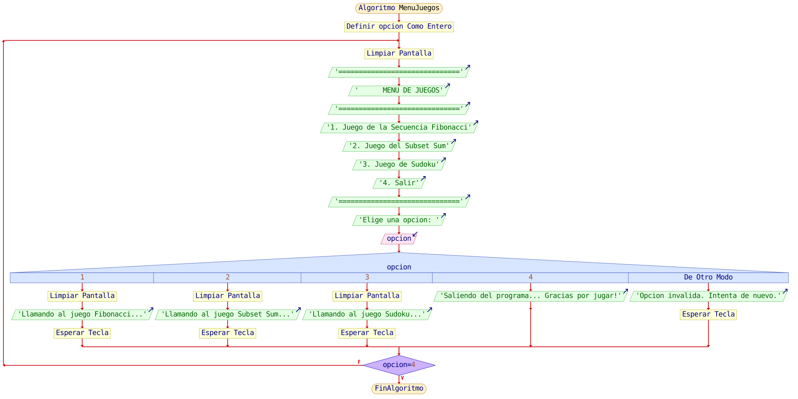

# Actividad 3 Estructura de datos
Esta actividad consistio de 3 juegos uno que es la secuencia fibonacci donde se le pide al usuario que ingrese un numero para que sea el top de la secuencia fibonacci otro donde esta subset sum donde se ingresa una lista de numeros y tiene que dar una suma que el usuario determine y otro que es un sudoku 9x9 con interfaz grafica 

# Diagrama de flujo

# Intgrantes de el equipo
- Humberto Terriquez
- Maximo Aguilar
- Angel Lopez
- Sergio Martinez
- Miguel Mendoza