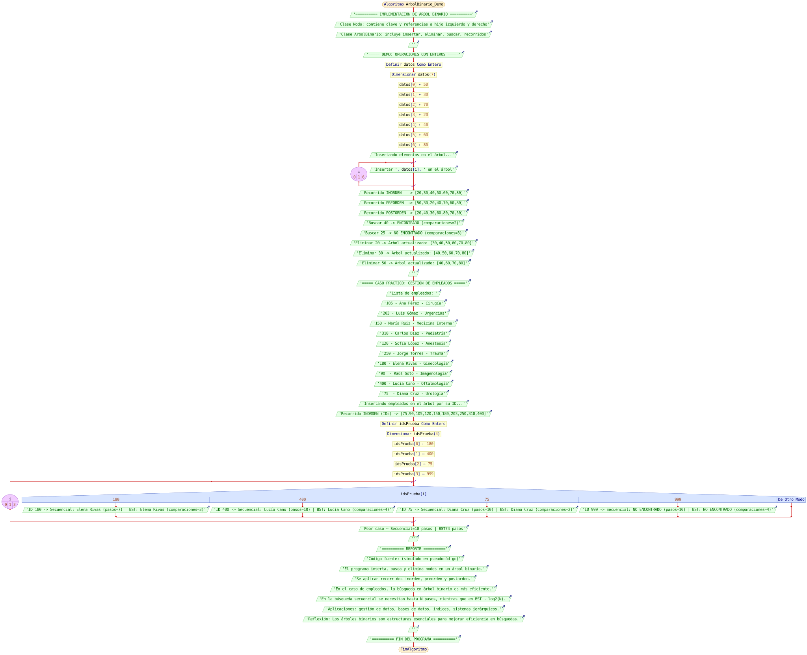

# Actividad 4 Estructura de datos
En esta practica se implementa un arbol binario de Búsqueda en Java, que permite realizar operaciones fundamentales como insertar, eliminar, buscar y recorrer el arbol en diferentes ordenes.

Como caso practico, se simula la gestión de empleados donde cada empleado esta representado por un identificador unico y su nombre. Con ello se demuestra como los arboles binarios mejoran la eficiencia en la gestion de información frente a una búsqueda secuencial.

# Diagrama de flujo

# Intgrantes de el equipo
- Humberto Terriquez
- Maximo Aguilar
- Angel Lopez
- Sergio Martinez
- Miguel Mendoza